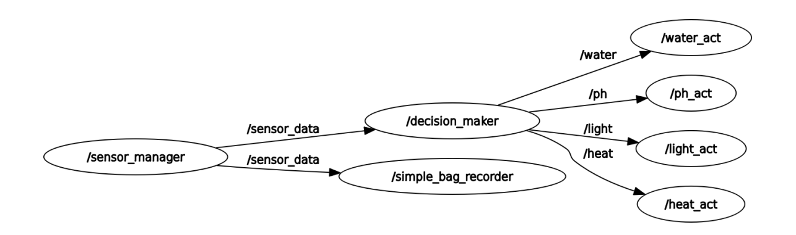

# PlantCareMonitor

Monitoring and Assistance System for Indoor Plants

## Table of Contents

- [Proposed Use Case](#usecase)
- [Development Achieved](#development)
- [Environment Setup and Usage](#setup)
- [License](#license)

## Proposed Use Case

The proposed system aims to simplify and enhance the care of indoor plants by providing continuous monitoring of critical environmental factors essential for their health and activating assistance measures as needed. Its primary purpose is to offer plant owners a tool that enables them to maintain an optimal environment for the growth and development of their indoor plants. By constantly monitoring factors such as temperature, light, soil pH, and soil moisture, the system can make informed decisions and activate assistance measures, such as watering or adjusting lighting, to ensure ideal conditions for the plants.

## Development Achieved

Below are the detailed descriptions of the main components of the system:

### Packages and Nodes
- **Package ‘plant monitor’**: Contains all the necessary nodes and configurations.
- **Node 1 - Sensor Manager**: Functions to collect data from the sensors installed in the plant environment and publish this information on a specific topic. The collected information is presented as a state array, which consists of four elements representing the plant care environment: temperature, luminosity, soil pH, and humidity.

    To simulate the environmental information received by the sensors, a state generator has been implemented. This generator uses a list of mean values and standard deviations to generate the simulated data. Each time a call is made to the generator, four values are returned, one for each parameter, which are created with a sinusoidal wave with noise from the established mean values and standard deviations.

    The values used in the state generator have been carefully selected to represent realistic environmental conditions and provide variability in the simulated data. For example, an average temperature of 22°C, a luminosity of 500 μmol/s/m², a soil pH of 6.0, and a soil moisture of 50% have been set. Along with their respective standard deviations, which vary between 4°C, 200 μmol/s/m², 0.5, and 20%, respectively, they allow simulating the expected natural fluctuations in these environmental parameters.

- **Node 2 - Decision Maker**: This node subscribes to the topic of the Sensor Manager, where it constantly receives environmental data. Its main function is to process this data and determine the actions needed to maintain an optimal environment for the plant in question. The user can adjust a total of 8 parameters dedicated to this node, which establish the expected values for the optimal state of the plant and the threshold ranges for temperature variation that trigger specific actions.

  Once these parameters are defined, the Decision Maker node uses this information to make informed decisions about the actions to be taken. For example, if the temperature exceeds the established threshold, the system can decide to increase or decrease the temperature as necessary.

  Finally, the node publishes a negative or positive value according to the action to be taken and its intensity. For example, if it is decided to increase the temperature by 4 degrees, a positive value corresponding to this action will be published. This approach ensures that the system can respond dynamically and efficiently to the changing needs of the plant, providing optimal care at all times.

- **Node 3 - Actuator Controller**: This node plays a crucial role in receiving the commands generated by the Decision Maker through its respective topic and executing them. Since the system has four control parameters (humidity, light, etc.), four corresponding actuator nodes will be implemented, each subscribed to its own specific topic.

  This architecture ensures that there is no loss of information due to the speed of decision-making, and that each system is controlled independently. In the current context of the system, where no physical actuator is connected, the Actuator Controller nodes simply transmit the received decisions to the user. This lays the foundation for future implementation, where these commands can be used to control physical devices such as irrigation systems, lights, or ventilation systems.

  This separation between decision-making and execution ensures greater modularity and flexibility in the system design, allowing for future expansions or modifications according to the user's needs.
### Topics

Based on the information provided about the topics used by each node, we can identify the following:

1. **Sensor Manager Node**:
   - **Topic**: `/sensor_data`
   - **Description**: Publishes an array [] containing the 4 parameters (temperature, luminosity, soil pH, soil moisture). The data type used in ROS is `Float32MultiArray`, and a custom message was not considered necessary for this purpose.

2. **Decision Maker Node**:
   - **Topics**: 
     - `/heat`
     - `/light`
     - `/water`
     - `/ph`
   - **Description**: Publishes independent actions for specialized actuators corresponding to each parameter:
     - `/heat`: Controls related to temperature.
     - `/light`: Controls related to luminosity.
     - `/water`: Controls related to soil moisture.
     - `/ph`: Controls related to soil pH.
   - **Data Type**: Each topic uses the data type `Float32`.

Through this communication structure, it is ensured that the data collected by the sensors is processed by the Decision Maker node and translated into specific actions for each aspect of the plant environment. This setup allows for effective control and management based on real-time sensor data, enhancing the system's ability to maintain optimal conditions for plant care.

In the following figure, you can visually appreciate the organization and flow of information within the system.




### Timer

A timer has been implemented in the "Sensor Manager" node to ensure periodic data collection. The collection frequency can be adjusted by the user using the parameter `rate`.

### Logger

To keep the user informed about the plant's status and decisions made, an event logging system has been used with the logging level set to "info".

### User Interaction

Users have the ability to interact with actuators through `rqt`, allowing direct control over the plant environment without intervention from the "Decision Maker" node. To achieve this, users can send float values to each of the corresponding actuator topics.

For example, to decrease the temperature by 2 degrees, a `float32` value of `2.0` can be published to the topic `/heat`. This action can be easily performed through `rqt`. Similarly, to increase the temperature by 2 degrees, the value should be negative (`-2.0`).

This same principle applies to controlling other aspects of the plant environment such as light, humidity, and pH. In each case, the user simply publishes a message with the desired value to the corresponding actuator topic.

For more information on how to perform this interaction using `rqt`, you can follow the tutorial provided at the following link: [ROS2 rqt tutorial](https://www.hadabot.com/learn-ros2-intro-rqt.html?step=rqt-to-publish-messages).


## Extra Implementations

Considering the intended use of the system and aiming to facilitate its setup, customization, and potential future extensions, the following implementations have been chosen:

### Launch File

A launch file has been created to initiate the entire system with a predefined configuration. This file includes all mentioned nodes with their parameters, simplifying the system startup process and ensuring a consistent and complete configuration. Additionally, this launch file sets the groundwork for future sections.

### Configuration File

A YAML configuration file is utilized during launch to facilitate system customization and fine-tuning. This file enables users to easily modify system parameters as needed without directly editing the source code. It provides flexibility and ease of configuration management, ensuring adaptability to different operational requirements.

### Docker

The system has been containerized using Docker to facilitate deployment regardless of the operating system used. This implementation not only ensures greater portability of the system but also reduces memory usage and provides a foundation for future scalability. Docker containers encapsulate the application and its dependencies, offering consistency in deployment environments and simplifying maintenance and updates.

### Temporal Data Logging in a Bag

To facilitate user access to data over time, a data logging system using the Rosbag2 package has been implemented. This tool allows subscribing to a topic and saving received data into a bag file while other processes are ongoing. In our system, this feature is useful for logging the plant environment over an indefinite period, providing users access to temporal data for analysis and evaluation.

To test its functionality, users can follow these steps:

1. **Ensure Bag Functionality**: If the bag functionality has been previously tested, make sure to delete the 'sensor_bag' folder created when launching the bag instance. In our case, this folder would be located at 'ros_ws/src/plant_monitor'.

2. **Setup System**: Follow the environment setup and usage configuration steps as described in the setup section.

3. **Stop System Execution**: Stop the system execution using Ctrl+C.

4. **Execute Commands in Two Separate Terminals**:
   - Terminal 1:
     ```
     $ ros2 bag play sensor_bag
     ```
     This command plays the previously recorded bag file named 'sensor_bag'.

   - Terminal 2:
     ```
     $ ros2 topic echo /sensor_data
     ```
     This command subscribes to the '/sensor_data' topic and echoes the data being published.

## Environment Setup and Usage

### 4.1 Using Docker

To set up the system using Docker, users can follow these steps:

1. **Ensure Docker Installation**:
   - Make sure Docker is installed on your operating system. Detailed instructions for installing Docker can be found in the official documentation: [Docker Documentation](https://docs.docker.com/get-docker/).

2. **Download Dockerfile**:
   - Download the Dockerfile provided along with the rest of the source code of the system.

3. **Organize Source Code**:
   - Organize the source code in a folder named 'plant_monitor'.

4. **Build Docker Image**:
   - Navigate to the 'plant_monitor' folder in your terminal and add the Dockerfile there.
   - Build the Docker image using the following command:
     ```
     docker build -t plant_monitor .
     ```
   - This command builds a Docker image named 'plant_monitor' based on the Dockerfile provided.

5. **Run Docker Container**:
   - Once the container image is built, you can run the container using the following command:
     ```
     docker run -it --rm plant_monitor bash
     ```
   - This command starts the container and opens a bash terminal inside the Docker container (`plant_monitor`).

6. **Configuration of ros package**:
    - Once you have opened the terminal inside the Docker container (`plant_monitor`):

    - **Navigate to ROS Workspace and Build**:
        ```
        cd /ros_ws && colcon build
        ```
        This command navigates to the ROS workspace (`/ros_ws`) and builds the packages using `colcon`.

    - **Source Setup Script**:
        ```
        source /ros_ws/install/local_setup.bash
        ```
        This command sources the setup script to set up the environment variables for the installed packages.

    - **Launch System**:
        ```
        ros2 launch plant_monitor plant_monitor.launch.py
        ```
        Launches the system using the specified launch file (`plant_monitor.launch.py`).

    - **Stopping Execution**:
        - Use `Ctrl+C` to stop the program execution.
        - To exit the Docker container, type:
            ```
            exit
            ```

### 4.2 Without Docker (Linux)

Assuming a Linux operating system with all system dependencies installed:

- Download the source code, ensuring it is organized in a folder named 'plant_monitor'.
- Execute the Bash commands mentioned in section 4.1 to build and run the complete system.

### 4.3 Usage Video

The video demonstrating the implemented bag functionality and terminal interaction, as discussed in the Development section, has been provided in the repository under the filename "Use_video.webm".

## License

This project is licensed under the MIT License - see the [LICENSE](LICENSE) file for details.
